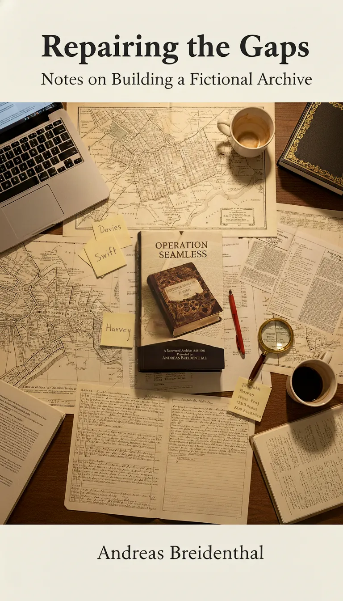

`A Companion to Operation Seamless`

# Repairing the Gaps

**_Notes on Building a Fictional Archive_**

*Andreas Breidenthal*

***

This isn't a story. It's the architecture behind one.

*Operation Seamless* was built to feel like a recovered archive — a fiction that could plausibly inhabit the gaps of the historical record. Every element was designed to stand alone yet contribute to a coherent whole.

The realism was intentional. The structure mimics the rhythm of archival discovery. The tone echoes the language of official recordkeeping. The details are anchored in real places, real people, and genuine historical silences.

What follows is not a set of rules, but a record of choices: the research that informed them, the structural logic that held them together, and the ethical questions that surfaced along the way.

[Begin reading →](https://andreas-breidenthal.github.io/repairing-the-gaps/index.html)
